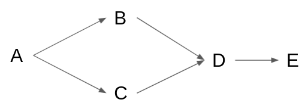
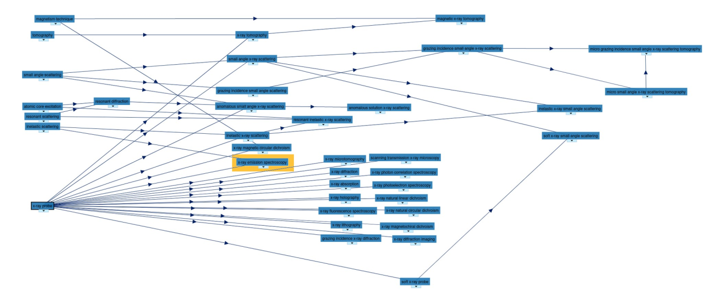
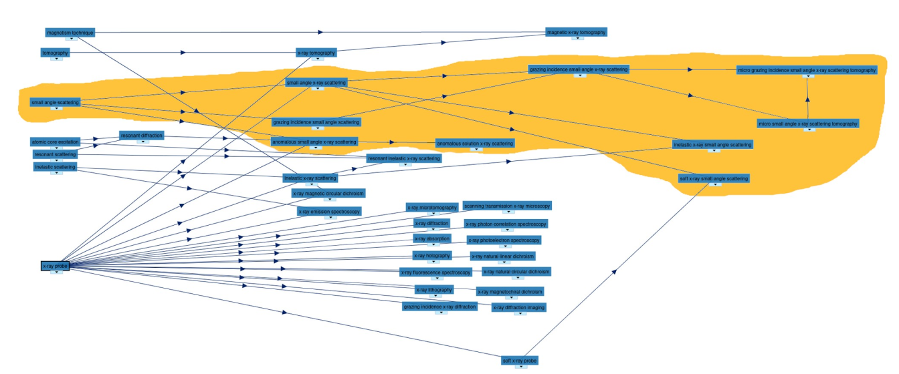
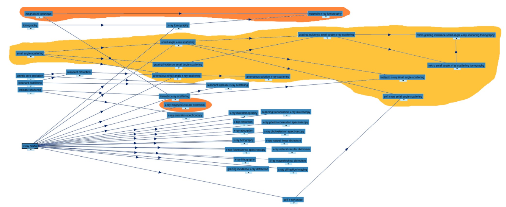
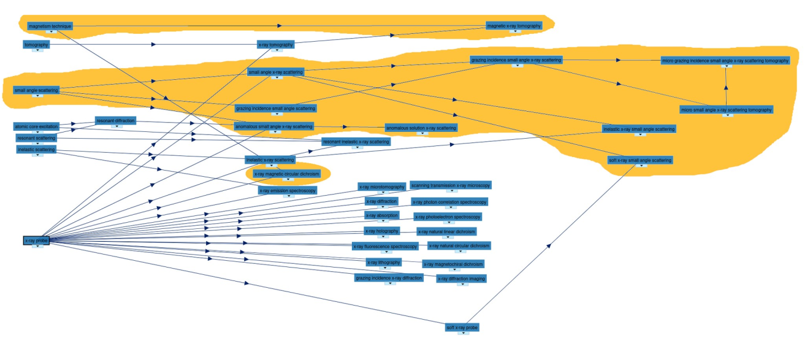
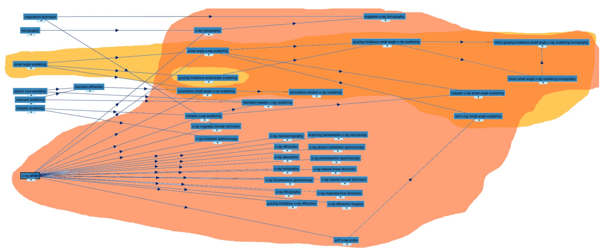
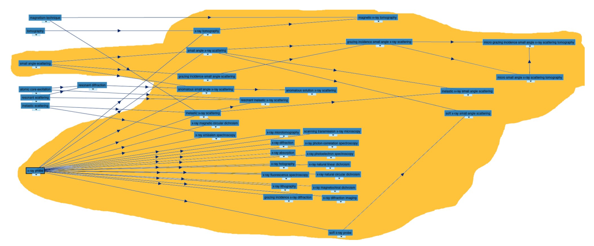
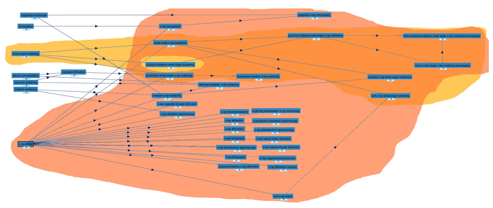
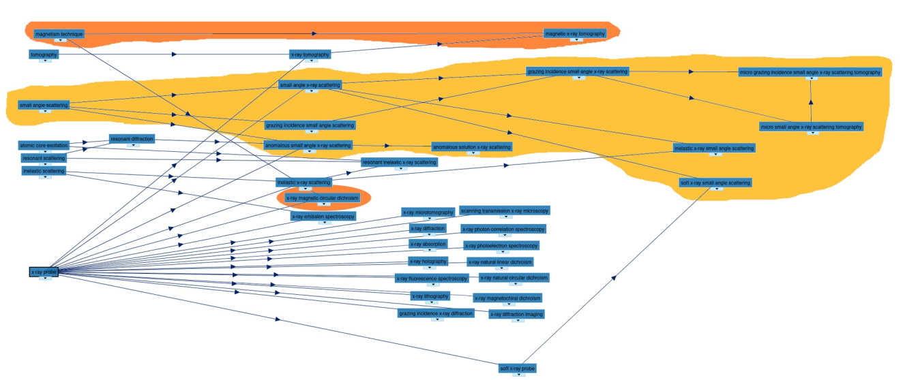

:warning: **the current requirement document only states the requirements and does not have a corresponding implementation in the demonstrator**.

# Query
Filtering based on the experimental techniques is possible as part of the Dataset endpoint, using the loopback syntax and its include functionality, thus the following examples will be using the `GET /datasets` endpoint.

# Techniques ontology
As part of the work carried out in the ExPaNDS [deliverable 3.2](https://zenodo.org/record/4806026#.YZPfg3vMKV4), the techniques ontology has been developed and can be found and navigated in [BioPortal](https://bioportal.bioontology.org/ontologies/PANET).

It includes a set of techniques organised in a hierarchical structure and follows the general principle: the deeper in the hierarchy, the more detailed. The techniques with common ancestors in the hierarchy are different specifications of the same class.


## Integration requirement
When querying a term in the technique ontology, the end-user should obtain all the datasets collected using that particular experimental technique or any other technique which is a descendant of it (*deep* property). Given a technique A, a descendant is any technique deeper than A in the hierarchy and which has A as an ancestor. For example, in figure 1, `B`; `C` and `D` are descendants of `A`; while `D` is a descendant of `B` and `C`; `E` is a descendant of `D`.



## Search functionalities

The implementation of the ontology integration in the search-api should allow at least querying using the PIDs of the ontology.
In terms of loopback syntax that translates to, e.g.:

```json
{
  "include": [
      {
          "relation": "techniques",
          "scope": {
              "where": {
                  "pid": "http://purl.org/pan-science/PaNET/PaNET01213"
              }
          }
      }
  ]
}
```

## Operators

As part of the implementation, all the operators should be *deep operators*. When the end-user queries one or more techniques, these operators will return all the datasets collected using that particular experimental technique(s) or any other technique which is a descendant of it. For simplicity, in the following descriptions, the term descendant will also include the technique searched by the end-user.

At least the following operators should be supported.

:warning: The syntax outlined below represents possible values of `include.scope.where` from the syntax depicted above.

- **Equal to**:

  It returns all datasets tagged with any of the descendants of the technique searched.
  - short form:
  ```json
  {
    "pid": "http://purl.org/pan-science/PaNET/PaNET01213"
  }
  ````
  - long form:
  ```json
  {
    "pid": {
      "eq": "http://purl.org/pan-science/PaNET/PaNET01213"
    }
  }
  ```

- **Not equal to**:

  It returns all datasets tagged with any technique different from any of the descendants of the technique searched.

  ```json
  {
    "pid": {
      "neq": "http://purl.org/pan-science/PaNET/PaNET01213"
    }
  }
  ```

- **And**:

  It returns all the datasets with at least one tag from the descendants of the first and one from the descendants of the second.

  ```json
  {
    "and": [
        {
            "pid": "http://purl.org/pan-science/PaNET/PaNET01212"
        },
        {
            "pid": "http://purl.org/pan-science/PaNET/PaNET01154"
        }
    ]
  }
  ```

- **Or**:

  It returns all datasets tagged with at least one technique from the descendants of any of the ones searched.

  ```json
  {
    "or": [
        {
            "pid": "http://purl.org/pan-science/PaNET/PaNET01212"
        },
        {
            "pid": "http://purl.org/pan-science/PaNET/PaNET01154"
        }
    ]
  }
  ```

The implementation should support any combination of these operators.


# Examples

Let's suppose we have the following datasets with the relative techniques:

| Dataset Id | Techniques |
|---|---|
| 1 | Resonant inelastic x-ray scattering |
| 2 | Anomalous solution x-ray scattering |
| 3 | Grazing incidence small angle x-ray scattering |
| 4 | Inelastic x-ray small angle scattering |
| 5 | Soft x-ray small angle scattering |
| 6 | Magnetic x-ray tomography |
| 7 | X-ray emission spectroscopy |
| 8 | X-ray emission spectroscopy, magnetic x-ray tomography |
| 9 | X-ray emission spectroscopy, grazing incidence small angle scattering |
| 10 | X-ray emissions spectroscopy, anomalous solution x-ray scattering |

:warning: Techniques are referred by their name for the sake of clarity of the example. In a real situation, the name will be substituted by the technique PID.

## Query 1

### Use case
The end-user is looking for datasets tagged with *X-ray emission spectroscopy* or any of its descendants.

### User query
```json
{
  "include": [
      {
          "relation": "techniques",
          "scope": {
              "where": {
                  "name": "x-ray emission spectroscopy"
              }
          }
      }
  ]
}
```

### Corresponding technique and descendants in the ontology
Highlighted in yellow is the technique descendants set for *x-ray emission spectroscopy* technique:



### Returned datasets
| Dataset Id | Techniques | Returned
|---|---|---|
| 1 | Resonant inelastic x-ray scattering | |
| 2 | Anomalous solution x-ray scattering | |
| 3 | Grazing incidence small angle x-ray scattering | |
| 4 | Inelastic x-ray small angle scattering | |
| 5 | Soft x-ray small angle scattering | |
| 6 | Magnetic x-ray tomography | |
| 7 | X-ray emission spectroscopy | Y |
| 8 | X-ray emission spectroscopy, magnetic x-ray tomography | Y |
| 9 | X-ray emission spectroscopy, grazing incidence small angle scattering | Y |
| 10 | X-ray emissions spectroscopy, anomalous solution x-ray scattering | Y |

## Query 2

### Use case
The end-user searches for datasets tagged with the technique *small angle scattering* or any of their descendants.

### User query
```json
{
  "include": [
      {
          "relation": "techniques",
          "scope": {
              "where": {
                  "name": "small angle scattering"
              }
          }
      }
  ]
}
```

### Corresponding technique and descendants in the ontology
Highlighted in yellow is the technique descendants set for *small angle scattering* technique:



### Returned datasets
| Dataset Id | Techniques | Returned
|---|---|---|
| 1 | Resonant inelastic x-ray scattering | |
| 2 | Anomalous solution x-ray scattering | Y |
| 3 | Grazing incidence small angle x-ray scattering | Y |
| 4 | Inelastic x-ray small angle scattering | Y |
| 5 | Soft x-ray small angle scattering | Y |
| 6 | Magnetic x-ray tomography | |
| 7 | X-ray emission spectroscopy | |
| 8 | X-ray emission spectroscopy, magnetic x-ray tomography | |
| 9 | X-ray emission spectroscopy, grazing incidence small angle scattering | Y |
| 10 | X-ray emissions spectroscopy, anomalous solution x-ray scattering | Y |

## Query 3

### Use case
The end-user is looking for datasets not tagged with *x-ray emission spectroscopy* or any of its descendants.

### User query
```json
{
  "include": [
      {
          "relation": "techniques",
          "scope": {
              "where": {
                  "name": {
                      "neq": "x-ray emission spectroscopy"
                  }
              }
          }
      }
  ]
}
```
### Corresponding technique and descendants in the ontology
Highlighted in yellow is the technique descendants set for *x-ray emission spectroscopy* technique:


### Returned datasets
| Dataset Id | Techniques | Returned
|---|---|---|
| 1 | Resonant inelastic x-ray scattering | Y |
| 2 | Anomalous solution x-ray scattering | Y |
| 3 | Grazing incidence small angle x-ray scattering | Y |
| 4 | Inelastic x-ray small angle scattering | Y |
| 5 | Soft x-ray small angle scattering | Y |
| 6 | Magnetic x-ray tomography | Y |
| 7 | X-ray emission spectroscopy | |
| 8 | X-ray emission spectroscopy, magnetic x-ray tomography | |
| 9 | X-ray emission spectroscopy, grazing incidence small angle scattering | |
| 10 | X-ray emissions spectroscopy, anomalous solution x-ray scattering | |


## Query 4

### Use case
The end-user is searching for datasets not tagged with *small angle scattering* or any of their descendants.

### User query
```json
{
  "include": [
      {
          "relation": "techniques",
          "scope": {
              "where": {
                  "name": {
                      "neq": "small angle scattering"
                  }
              }
          }
      }
  ]
}
```

### Corresponding technique and descendants in the ontology
Hilighted in yellow is the technique descendants set for *small angle scattering* technique:


### Returned datasets
| Dataset Id | Techniques | Returned
|---|---|---|
| 1 | Resonant inelastic x-ray scattering | Y |
| 2 | Anomalous solution x-ray scattering | |
| 3 | Grazing incidence small angle x-ray scattering | |
| 4 | Inelastic x-ray small angle scattering | |
| 5 | Soft x-ray small angle scattering | |
| 6 | Magnetic x-ray tomography | Y |
| 7 | X-ray emission spectroscopy | Y |
| 8 | X-ray emission spectroscopy, magnetic x-ray tomography | Y |
| 9 | X-ray emission spectroscopy, grazing incidence small angle scattering | |
| 10 | X-ray emissions spectroscopy, anomalous solution x-ray scattering | |

## Query 5

### Use case
The end-user is searching for datasets tagged with both techniques *small angle scattering* and *magnetism technique*  or any of their descendants.

### User query
```json
{
  "include": [
      {
          "relation": "techniques",
          "scope": {
              "where": {
                  "and": [
                      {
                          "name": "small angle scattering"
                      },
                      {
                          "name": "magnetism technique"
                      }
                  ]
              }
          }
      }
  ]
}
```

### Corresponding technique and descendants in the ontology
Highlighted in orange is the technique descendants set of *magnetism technique*, while in yellow is the technique descendants set of *small angle scattering*. Each dataset must be tagged with at least one technique from both sets to be selected:



### Returned datasets
| Dataset Id | Techniques | Returned
|---|---|---|
| 1 | Resonant inelastic x-ray scattering | |
| 2 | Anomalous solution x-ray scattering | |
| 3 | Grazing incidence small angle x-ray scattering | |
| 4 | Inelastic x-ray small angle scattering | |
| 5 | Soft x-ray small angle scattering | |
| 6 | Magnetic x-ray tomography | |
| 7 | X-ray emission spectroscopy | |
| 8 | X-ray emission spectroscopy, magnetic x-ray tomography | |
| 9 | X-ray emission spectroscopy, grazing incidence small angle scattering | |
| 10 | X-ray emissions spectroscopy, anomalous solution x-ray scattering | |

## Query 6

### Use case
The end-user is searching for datasets tagged with techniques *small angle scattering* or *technique magnetism* technique or any of their descendants.

### User query
```json
{
  "include": [
      {
          "relation": "techniques",
          "scope": {
              "where": {
                  "or": [
                      {
                          "name": "small angle scattering"
                      },
                      {
                          "name": "magnetism technique"
                      }
                  ]
              }
          }
      }
  ]
}
```

### Corresponding technique and descendants in the ontology
Highlighted in yellow is the set with all the valid techniques. The *or* between two techniques is equivalent to the techniques belonging to the union of the techniques descendants sets. Each dataset is selected if any of the techniques tagged with the ones belonging to the union of the sets:



### Returned datasets
| Dataset Id | Techniques | Returned
|---|---|---|
| 1 | Resonant inelastic x-ray scattering | |
| 2 | Anomalous solution x-ray scattering | Y |
| 3 | Grazing incidence small angle x-ray scattering | Y |
| 4 | Inelastic x-ray small angle scattering | Y |
| 5 | Soft x-ray small angle scattering | Y |
| 6 | Magnetic x-ray tomography | Y |
| 7 | X-ray emission spectroscopy | |
| 8 | X-ray emission spectroscopy, magnetic x-ray tomography | Y |
| 9 | X-ray emission spectroscopy, grazing incidence small angle scattering | Y |
| 10 | X-ray emissions spectroscopy, anomalous solution x-ray scattering | Y |

## Query 7

### Use case
The end-user is looking for datasets tagged with both techniques *small angle scattering* and *x-ray probe* or any of their descendants.

### User query
```json
{
  "include": [
      {
          "relation": "techniques",
          "scope": {
              "where": {
                  "and": [
                      {
                          "name": "small angle scattering"
                      },
                      {
                          "name": "x-ray probe"
                      }
                  ]
              }
          }
      }
  ]
}
```

### Corresponding technique and descendants in the ontology
Highlighted in yellow is the technique descendants set for technique *small angle scattering*, while in orange is the technique descendants set for technique *x-ray probe*. Selected datasets must be tagged with one technique from both sets:



### Returned datasets
| Dataset Id | Techniques | Returned
|---|---|---|
| 1 | Resonant inelastic x-ray scattering | |
| 2 | Anomalous solution x-ray scattering | Y |
| 3 | Grazing incidence small angle x-ray scattering | Y |
| 4 | Inelastic x-ray small angle scattering | Y |
| 5 | Soft x-ray small angle scattering | Y |
| 6 | Magnetic x-ray tomography | |
| 7 | X-ray emission spectroscopy | |
| 8 | X-ray emission spectroscopy, magnetic x-ray tomography | |
| 9 | X-ray emission spectroscopy, grazing incidence small angle scattering | Y |
| 10 | X-ray emissions spectroscopy, anomalous solution x-ray scattering | Y |

## Query 8

### Use case
The end-user searches for datasets tagged with either techniques *small angle scattering* and *x-ray probe* or any of their descendants.

### User query
```json
{
  "include": [
      {
          "relation": "techniques",
          "scope": {
              "where": {
                  "or": [
                      {
                          "name": "small angle scattering"
                      },
                      {
                          "name": "x-ray probe"
                      }
                  ]
              }
          }
      }
  ]
}
```

### Corresponding technique and descendants in the ontology
Highlighted in yellow is the techniques set resulting from the union of the technique descendants sets of the techniques *small angle scattering* and *x-ray probe*. The selected datasets must be tagged with at least one technique belonging to the resulting set:



### Returned datasets
| Dataset Id | Techniques | Returned
|---|---|---|
| 1 | Resonant inelastic x-ray scattering | Y |
| 2 | Anomalous solution x-ray scattering | Y |
| 3 | Grazing incidence small angle x-ray scattering | Y |
| 4 | Inelastic x-ray small angle scattering | Y |
| 5 | Soft x-ray small angle scattering | Y |
| 6 | Magnetic x-ray tomography | Y |
| 7 | X-ray emission spectroscopy | Y |
| 8 | X-ray emission spectroscopy, magnetic x-ray tomography | Y |
| 9 | X-ray emission spectroscopy, grazing incidence small angle scattering | Y |
| 10 | X-ray emissions spectroscopy, anomalous solution x-ray scattering | Y |

## Query 9

### Use case
The end-user is looking for datasets tagged with technique *small angle scattering* or any of its descendants but not with *x-ray probe* or any of its descendants.

### User query
```json
{
  "include": [
      {
          "relation": "techniques",
          "scope": {
              "where": {
                  "and": [
                      {
                          "name": "small angle scattering"
                      },
                      {
                          "name": {
                              "neq": "x-ray probe"
                          }
                      }
                  ]
              }
          }
      }
  ]
}
```

### Corresponding technique and descendants in the ontology
Highlighted in yellow is the technique descendants set for technique *small angle scattering*, while in orange is the technique descendants set for technique *x-ray probe*. Each selected dataset must be tagged with one technique from the yellow set, but not with any technique from the orange set:



### Returned datasets
| Dataset Id | Techniques | Returned
|---|---|---|
| 1 | Resonant inelastic x-ray scattering | |
| 2 | Anomalous solution x-ray scattering | |
| 3 | Grazing incidence small angle x-ray scattering | |
| 4 | Inelastic x-ray small angle scattering | |
| 5 | Soft x-ray small angle scattering | |
| 6 | Magnetic x-ray tomography | |
| 7 | X-ray emission spectroscopy | |
| 8 | X-ray emission spectroscopy, magnetic x-ray tomography | |
| 9 | X-ray emission spectroscopy, grazing incidence small angle scattering | |
| 10 | X-ray emissions spectroscopy, anomalous solution x-ray scattering | |


## Query 10

### Use case
The end-user is searching for datasets tagged with technique *small angle scattering* or any of its descendants but not with *magnetism technique* or any of its descendants.

### User query
```json
{
  "include": [
      {
          "relation": "techniques",
          "scope": {
              "where": {
                  "and": [
                      {
                          "name": "small angle scattering"
                      },
                      {
                          "name": {
                              "neq": "magnetism technique"
                          }
                      }
                  ]
              }
          }
      }
  ]
}
```

### Corresponding technique and descendants in the ontology
Highlighted in orange is the technique descendants set of *magnetism technique*, while in yellow is the technique descendants set of *small angle scattering*. The selected dataset must be tagged with any of the techniques in the yellow set, but not with any on the orange set:



### Returned datasets
| Dataset Id | Techniques | Returned
|---|---|---|
| 1 | Resonant inelastic x-ray scattering | |
| 2 | Anomalous solution x-ray scattering | Y |
| 3 | Grazing incidence small angle x-ray scattering | Y |
| 4 | Inelastic x-ray small angle scattering | Y |
| 5 | Soft x-ray small angle scattering | Y |
| 6 | Magnetic x-ray tomography | |
| 7 | X-ray emission spectroscopy | |
| 8 | X-ray emission spectroscopy, magnetic x-ray tomography | |
| 9 | X-ray emission spectroscopy, grazing incidence small angle scattering | Y |
| 10 | X-ray emissions spectroscopy, anomalous solution x-ray scattering | Y |
